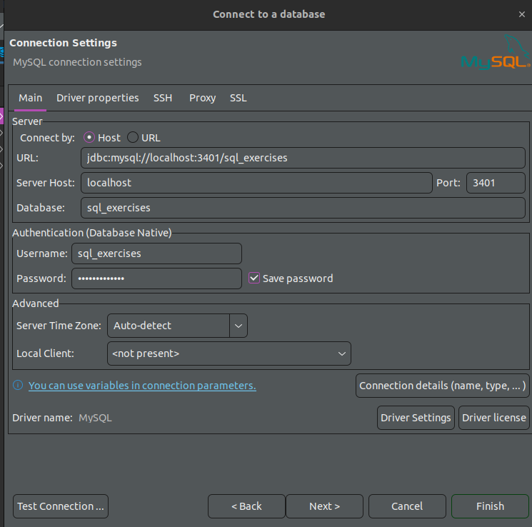
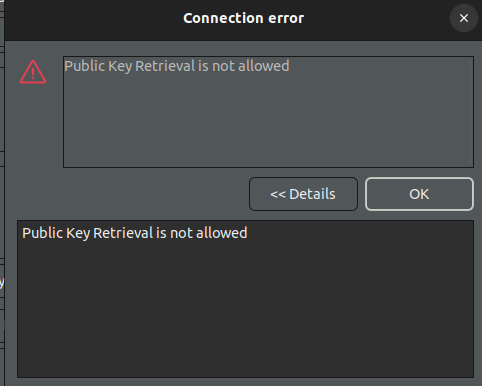
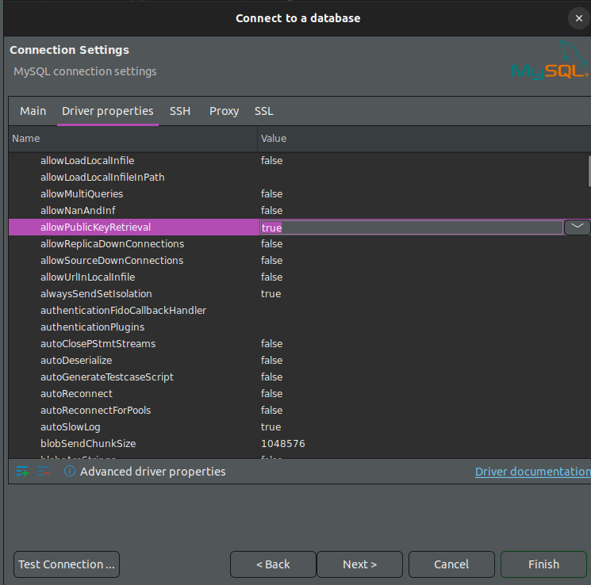

# SQL-Exercises

This project aims to set up the [SQL-Exercises](https://en.wikibooks.org/wiki/SQL_Exercises) wiki using Docker Compose. This way, you can immediately dive into the questions without worrying about the setup process.

## Set up the databases

Before you go, please ensure that you have already installed Docker and can successfully run it. To set up the databases, you can execute the following command:

```bash
sudo docker compose up
```

You can now connect to the databases using your preferred database tool. I recommend using [DBeaver](https://dbeaver.io/) for this purpose. For example, you can establish a connection to the database for exercise `01_the_computer_store` using the following configuration:

```yml
port: 3401
database: sql_exercises
username: sql_exercises
password: sql_exercises
```



Feel free to modify the port based on your current chapter, in the case of chapter `08_the_hospital` the port should be set to 3408.

If you encounter the "public key retrieval is not allowed" error,



please resolve it by setting `allowPublicKeyRetrieval` to `true` in the "Driver properties"


